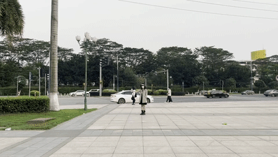

## 1.Experiment setting
* **Sampling rate : 10Hz** 
* **Motion mode: rotation**
* **Mobile phone's brand: JianguoPro2**
* **Mobile phone's OS: Android7.1.1**
## 2.Results

**Vedios**
* **Color vedio:**

  

* **Depth vedio:** 

  

**Figures**
* **The acceleration estimation by HSTD:**

  

* **The frequency domain of the acceleration:**

  

* **The magnitude squared cohenrence of two accelerations:**

  

**Final coherence**
**The final coherence of this experiment is 0.8427, exceeding the threshold of 0.55. Our attack works.**